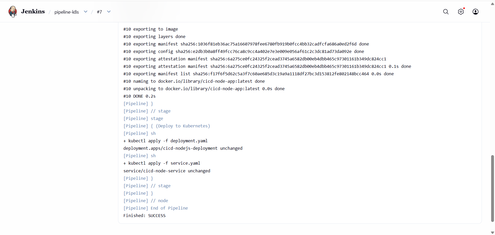
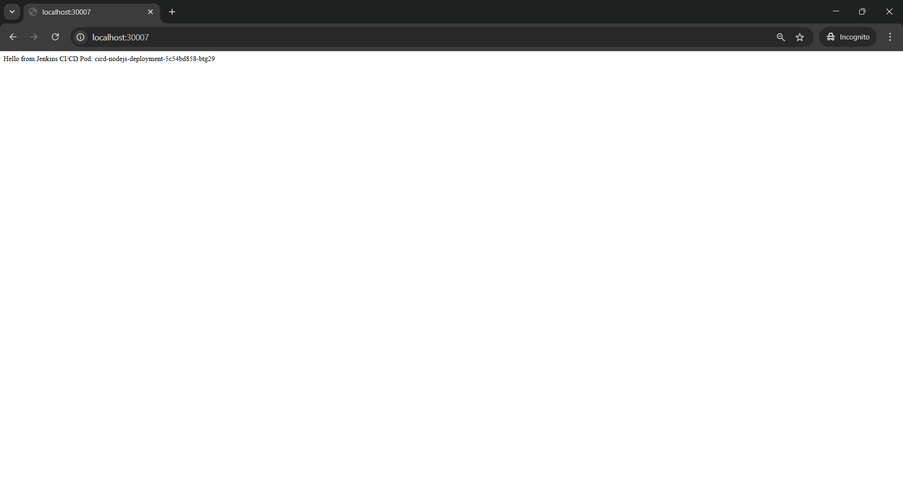

## Jenkins CI/CD Pipeline with Docker and Kubernetes

-----

## Project Overview
This project demonstrates an end-to-end CI/CD pipeline using Jenkins to automatically build a Docker image and deploy a Node.js application into a Kubernetes cluster.

The pipeline automates the process from source code commit → build → deployment → running application.

-----

## Tools & Technologies Used
- Jenkins (CI/CD Automation)
- Docker (Containerization)
- Kubernetes (Container Orchestration)
- GitHub (Source Code Repository)
- Node.js (Sample Application)

------

## Project Architecture

GitHub Repository
        │
        ▼
     Jenkins Pipeline
        │
        ▼
    Docker Image Build
        │
        ▼
  Kubernetes Deployment
        │
        ▼
  Application Running in Pod

-----

## CI/CD Pipeline Workflow

1. Developer pushes the application code to GitHub.
2. Jenkins pipeline is triggered.
3. Jenkins clones the repository.
4. Docker builds the application image.
5. Jenkins deploys the application to Kubernetes using deployment and service YAML files.
6. Kubernetes creates the pod and exposes the application through a service.
7. The application becomes accessible in the browser.

-----

## Project Structure

Jenkins-kubernetes-CICD-Project
│
├── Jenkinsfile
├── Dockerfile
├── deployment.yaml
├── service.yaml
└── app
    ├── package.json
    └── server.js

----

## Application Output

The deployed application can be accessed in the browser using the Kubernetes NodePort service.

Example URL:

http://localhost:30007

Application response:

Hello from Jenkins CI/CD Pod

-----

## Project Screenshots

### Jenkins Pipeline Success

### Kubernetes Pod Running

### Application Output in Browser

-----

## Key Learning Outcomes

- Implemented a complete CI/CD pipeline using Jenkins.
- Built Docker images automatically through Jenkins pipeline.
- Deployed containerized applications into a Kubernetes cluster.
- Automated application delivery from source code to running service.

-----

## Conclusion

This project demonstrates how modern DevOps practices can automate application deployment using Jenkins, Docker, and Kubernetes.  
It shows a practical CI/CD workflow from GitHub source code to a running application inside Kubernetes.
